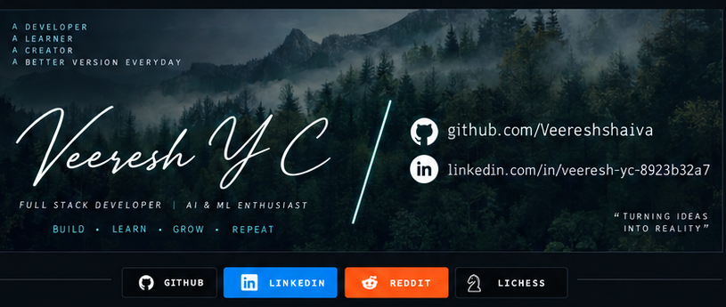

<!-- GitHub Profile Banner -->

 

&nbsp;

---

# 👋 Hi there, &lt; devs /&gt;

### 💻 Full Stack Developer | 🤖 AI & ML Enthusiast

I'm <strong>Veeresh Y C</strong>, a Computer Science Engineering student and developer from India.
I'm passionate about Full Stack Development, Artificial Intelligence, Machine Learning,
and building real-world software applications.

---

## 🛠️ Tech Stack

---

## 🚀 Featured Projects

### 🏥 Smart Healthcare ICU Monitoring

**Smart Healthcare ICU Monitoring with Predictive Alerts using IoT**

- Real-time ICU patient monitoring
- Heart Rate, SpO₂, Temperature, Blood Pressure and Respiratory Rate
- Normal / Warning / Critical / Predictive status
- Real-time alert system
- Patient and ICU-bed management
- Reports and patient history

**Technologies:** `React` `Node.js` `Express.js` `MongoDB` `IoT` `ESP32`

### 🤖 SHAIVA AI

AI-powered intelligent development platform concept combining multimodal input,
AI agents, planning, code generation, RAG/LLM and application development.

**Areas:** `AI Agents` `LLM` `RAG` `Computer Vision` `Generative AI` `Full Stack`

---

## 📊 GitHub Statistics

---

## 🔥 GitHub Streak

---

## 📈 Contribution Graph

---

## 🤝 Connect With Me

---

### ❤️ With ❤️ from India

**KEEP BUILDING • KEEP LEARNING • KEEP CREATING**

